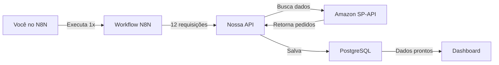

# Processo de Sincronização Inicial - 12 Meses

## Visão Geral
Processo único para popular o banco de dados com 12 meses de histórico de pedidos da Amazon.

## Quem Executa?
**VOCÊ** - Uma única vez, manualmente no N8N

## Fluxo de Execução

### 1. N8N Inicia o Workflow
```javascript
// Gera array com 12 meses
[
  { month: "2024-01", startDate: "2024-01-01", endDate: "2024-01-31" },
  { month: "2024-02", startDate: "2024-02-01", endDate: "2024-02-29" },
  { month: "2024-03", startDate: "2024-03-01", endDate: "2024-03-31" },
  // ... até dezembro 2024
]
```

### 2. Para Cada Mês, N8N:
```
→ Aguarda 65 segundos (rate limit)
→ Chama nossa API
→ POST http://localhost:8080/api/sync/orders
   Body: {
     startDate: "2024-01-01",
     endDate: "2024-01-31",
     month: "2024-01"
   }
```

### 3. Nossa API Processa:
```javascript
// SPAPIClient busca pedidos do mês
const orders = await spApiClient.getOrders({
  CreatedAfter: "2024-01-01",
  CreatedBefore: "2024-01-31",
  MarketplaceIds: ["ATVPDKIKX0DER"]
});

// DatabaseService salva no PostgreSQL
for (const order of orders) {
  await databaseService.saveOrder(order);
  await databaseService.saveOrderItems(order.items);
}
```

### 4. Dados Salvos no PostgreSQL:
```sql
-- Tabela: orders
INSERT INTO orders (
  amazon_order_id,
  purchase_date,
  order_status,
  order_total,
  buyer_email,
  ...
)

-- Tabela: order_items  
INSERT INTO order_items (
  order_id,
  asin,
  title,
  quantity_ordered,
  item_price,
  ...
)

-- Tabela: sync_logs
INSERT INTO sync_logs (
  sync_type: 'initial_load',
  period: '2024-01',
  orders_synced: 45,
  status: 'completed'
)
```

## Tempo Estimado

| Etapa | Tempo |
|-------|-------|
| Processamento por mês | ~5-10 segundos |
| Espera rate limit | 65 segundos |
| **Total por mês** | ~70 segundos |
| **TOTAL 12 MESES** | ~14 minutos |

## Como Executar

### 1. Verificar API rodando:
```bash
cd amazon-unified-backend
npm run dev
# Deve estar rodando na porta 8080
```

### 2. No N8N:
1. Importar arquivo: `amazon-initial-12-months-load.json`
2. Configurar credencial PostgreSQL (se necessário)
3. Clicar em "Execute Workflow"
4. Aguardar ~14 minutos

### 3. Monitorar Progresso:

**No terminal da API:**
```
[INFO] Starting sync for month 2024-01
[INFO] Found 45 orders to process
[INFO] Sync completed: 45 orders created, 0 updated
[INFO] Starting sync for month 2024-02
...
```

**No banco de dados:**
```sql
-- Ver progresso em tempo real
SELECT * FROM sync_logs 
WHERE sync_type = 'initial_load'
ORDER BY started_at DESC;

-- Contar total de pedidos
SELECT COUNT(*) FROM orders;
```

**No N8N:**
- Cada nó mostra ✅ quando completa
- Barra de progresso visual
- Notificações Slack (se configurado)

## Verificar Sucesso

### Após conclusão, verificar:

```sql
-- Total de pedidos por mês
SELECT 
  DATE_TRUNC('month', purchase_date) as month,
  COUNT(*) as orders,
  SUM(order_total) as revenue
FROM orders
GROUP BY 1
ORDER BY 1;

-- Status da sincronização
SELECT * FROM sync_logs
WHERE sync_type = 'initial_load'
ORDER BY period;
```

### No Dashboard:
```
http://localhost:8087
```
- Deve mostrar dados reais
- Gráficos populados
- Sem "mock data"

## Problemas Comuns

### API não está rodando
```bash
cd amazon-sp-api-service
npm run dev
```

### Rate limit error (429)
- Aumentar delay no workflow (atual: 65s)
- Verificar se não há outras chamadas simultâneas

### Sem dados retornados
- Verificar credenciais no .env
- Confirmar marketplace_id correto
- Verificar se conta tem pedidos no período

### PostgreSQL connection error
- Verificar conexão com <DB_HOST>:5456
- Confirmar credenciais no .env
- Testar: `npm run test:db`

## Importante!

⚠️ **EXECUTAR APENAS 1 VEZ!**
- Se executar novamente, tentará reprocessar tudo
- Sistema detecta duplicatas (ON CONFLICT)
- Mas consome rate limit desnecessariamente

## Próximos Passos

Após sincronização inicial:
1. ✅ 12 meses de dados no banco
2. ✅ Dashboard mostrando dados reais
3. ✅ Ativar sync diário no N8N
4. ✅ Sistema completo funcionando

## Resumo do Processo



**Tempo total: ~14 minutos**
**Execução: Manual, 1 vez apenas**
**Resultado: Banco populado com 12 meses de pedidos**